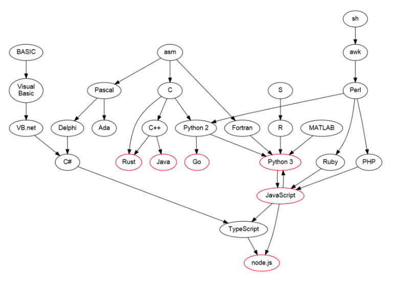

## 内容介绍
- 编程语言
    - 演化史 
        - 机器语言
        - 汇编语言
        - C语言:  结构化(函数)
            - 写操作系统
        - C++: 面向对象, 需要指针,需要人为去管理内存
            - 3D游戏
        - JAVA: 跨平台, 无指针
            - Android: Kotlin
            - IOS: Swift
        - [JavaScript](https://github.com/syntomic/Languages_and_Algorithms/tree/master/languages/javascript/): 事件驱动型,单线程执行
            - Web程序
        - [Python](https://github.com/syntomic/Languages_and_Algorithms/tree/master/languages/python/): 优雅, 简单, 明确
            - AI
    - 类型
        - 强类型 vs 弱类型
        - 静态 vs 动态
        - 解释型 vs 编译型
    - 编程范式
        - 命令式编程
        - 面向对象编程
        - 函数式编程
- 数据结构与算法
    - [Algorithms-illuminated](https://lagunita.stanford.edu/courses/course-v1:Engineering+Algorithms1+SelfPaced/about): Stanford Algorithm Course
        - [Notes](https://github.com/syntomic/Languages_and_Algorithms/tree/master/algorithms/algorithms_illuminated/)
    - [数据结构与算法-Python语言描述](https://github.com/syntomic/Languages_and_Algorithms/tree/master/algorithms/data_structures_and_algorithms_in_python/): 理解数据结构的构造
- [面试](https://github.com/syntomic/Languages_and_Algorithms/tree/master/interview/)

