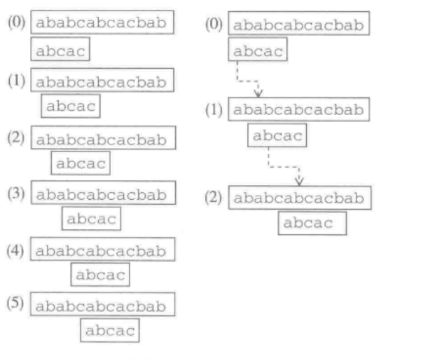
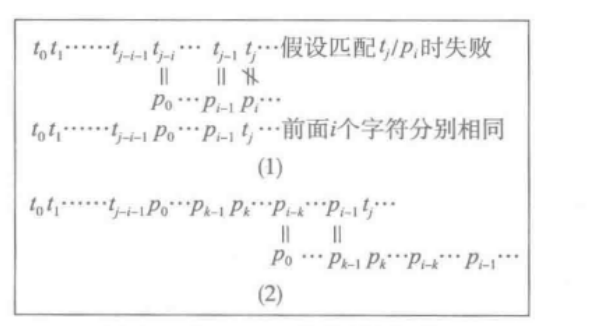
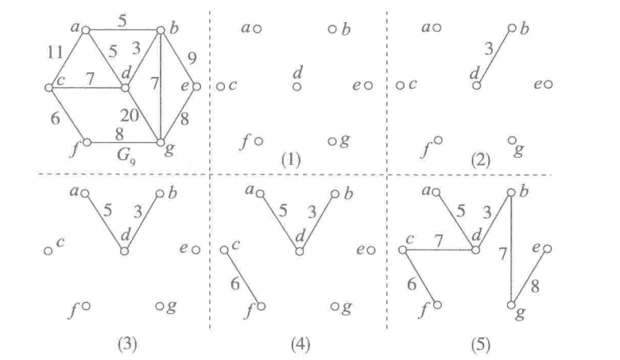
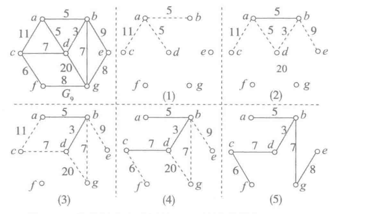
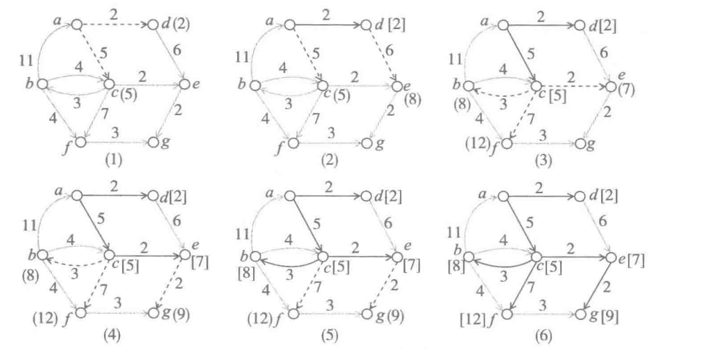

参考 数据结构与算法-Python语言描述 裘宗燕

## 绪论

- 计算机求解问题
    - 程序开发者针对问题开发程序 
        - 分析阶段
        - **设计阶段**  
        - 编码阶段
        - 检查测试阶段
        - 调试阶段
    - 使用者运行程序处理问题
- 问题求解:交叉路口的红绿灯安排
- 算法和算法分析
    - 算法
        - 确定性算法
        - 非确定算法；并行算法，概率算法
        - 过程(procedure)：并不要求终止的计算描述
    - 算法设计模式
        - 枚举法
        - 贪心法
        - 分治法
        - 回溯法(搜索法)
        - 动态规划法:根据已知信息,动态选择最好求解路径
        - 分支限定法
    - 代价:Master method $T(n)=O(n^k)+aT(n/b)$
        - ~~最少需要多少时间~~
        - 最多需要多少时间
        - 平均需要多少时间
    - python计算复杂度:避免高级语言的"效率陷阱"
        - 时间:添加/删除最后一个元素效率高
            - 有趣的事：字典操作效率一般很高，但偶然也会出现效率低的情况
        - 空间
            - 各种组合数据对象没有预设最大元素个数(动态)
            - 自动存储管理系统
- 数据结构
    - 信息
    - 数据：编码的信息
    - 数据结构：数据之间的关联和组合的形式 $D = (E, R)$
        - 结构性数据结构：相互关系
            - 集合结构
            - [序列结构](https://github.com/syntomic/Languages_and_Algorithms/tree/master/algorithms/data_structures_and_algorithms_in_python/linked_list/)
                - [字符串](https://github.com/syntomic/Languages_and_Algorithms/tree/master/algorithms/data_structures_and_algorithms_in_python/string/)
                - 链接结构
            - 层次结构
            - [树形结构](https://github.com/algorithms/syntomic/Languages_and_Algorithms/tree/master/data_structures_and_algorithms_in_python/Tree/)
            - [图结构](https://github.com/syntomic/Languages_and_Algorithms/tree/master/algorithms/data_structures_and_algorithms_in_python/graph/)
        - 功能性数据结构：实现功能，eg：元素储存和访问
            - [栈](https://github.com/syntomic/Languages_and_Algorithms/tree/master/algorithms/data_structures_and_algorithms_in_python/Stack/)
            - [队列](https://github.com/syntomic/Languages_and_Algorithms/tree/master/algorithms/data_structures_and_algorithms_in_python/Queue/)
                - 优先队列
            - [字典](https://github.com/syntomic/Languages_and_Algorithms/tree/master/algorithms/data_structures_and_algorithms_in_python/search_and_sort/)
    - 抽象数据类型:区分模块的接口和实现
    - python对象和数据结构
        - 对象标识:`id`
        - 引用语义：变量 -> 对象
## 线性表：某类元素的一个集合，记录着元素之间的顺序关系
- 整体考虑 
    - 实现者角度
        - 结构内部的数据组织好，设计一种合适的表示
        - 提供一套有用而且必要的操作，并有效实现这些操作
    - 使用者角度
        - 考虑该结构提供了那些操作
        - 如何有效使用以解决自己的问题
- 表抽象数据类型
    - 线性表操作
        - 创造对象
        - 获取各方面信息：是否为空，长度。。
        - 动态改变表的内容
        - 涉及一个或两个表的操作
        - 表中每一个元素的操作
    - 线性表的实现
        - 基本考虑
            - 计算机内存特点，保存元素和元素顺序信息的需要
            - 各种重要操作的效率
        - 模型
            - 顺序表：存放在一大块连续的储存区
            - 链表：通过链接构造的一系列储存块
- 顺序表
    - 基本实现方式
        - 表元素大小
            - 每个元素存储量相同：等距安排
            - 大小不统一：实际元素另行储存，保留链接信息(索引结构)
        - 储存区大小
            - 不变：按建立时元素个数分配储存
            - 变动：记录当前元素个数和元素储存区容量
    - 基本操作的实现(变动的顺序表)
        - 创建和访问操作：不修改表的结构
            - 创建空表
            - 简单判断操作
            - 访问给定下标的元素
            - 遍历操作
            - 查找：给定元素(在位置k时)第一次出现的位置
        - 变动操作
            - 加入元素
                - 尾端：分期付款式$O(1)$(变动)
                - 第i个位置：$O(n)$
            - 删除元素
                - 尾端：$O(1)$
                - 第i个位置：$O(n)$
                - 基于条件删除：$O(n)$
        - 两种基本实现方式
            - 一体式结构
            - 分离式结构
        - 动态扩容：线性vs加倍 时间or空间
    - python中的list
        - 顺序表技术
        - 分离式技术：表对象id不变
        - 动态扩容：8 -> 4倍 -> 加倍
        - 几个操作
            - `lst.clear()`:将元素计数器设置为0或另行分配一个空表的存储区
            - `lst.reverse()`:$O(n)$
            - `lst.sort()`:$O(n\log n)$
- 链接表
    - 单链表：$node =  (elem, next)$
        - 基本操作
            - 创建空链表: $O(1)$
            - 删除链表：python的储存管理系统自动回收 $O(1)$
            - 判断表是否为空：$O(1)$
            - 加入元素
                - 表首端加入：$O(1)$
                - 一般情况的加入：$O(n)$
            - 删除元素
                - 表首段删除：$O(1)$
                - 一般情况的删除：$O(n)$
            - 扫描，定位和遍历：$O(n)$
            - 求表的长度
                - 遍历：$O(n)$
                - 效率：变化实现方式
            - 筛选生成器:满足条件的多个元素
    - 链表的变形
        - 带有尾节点的单链表：尾端加入效率高
            - 继承和扩充定义
            - 初始化和变动操作
            - 类设计的内在一致性
        - 循环单链表：表头/表尾插入，表头删除
        - 双链表：两端插入和删除操作(空间换时间)
        - 循环双链表:首尾两端元素加入/删除
    - 两个链表操作
        - 链表反转
        - 链表排序
            - 插入排序
                - 移动表中元素
                - 调整结点之间的链接关系
- 应用:基于循环单链表的Josephus解
## 字符串
- 相关概念
    - 字符集：ASCII、Unicode、UTF-8
    - 字符串：由字符集中元素组成的线性表
        - 幺半群：字符串集合加上拼接操作
    - 字符串抽象数据类型
- 字符串的实现
    - 字符串的表示
        - 内容的存储：连续存储vs链接
        - 结束的表示：数据域vs特殊编码
    - 字符串的操作
        - 线性表的常规操作
        - 串替换：找到子串匹配
    - 实际语言里的字符串
        - 可变vs不可变(python)
        - 独立字符类型(java)vs长度为1的字符串(python)
        - 基本字符集的选择(unicode)
    - python的字符串
        - 一体式顺序表表示:长度+其他信息+字符存储区
        - 操作
            - 获取已有对象信息：长度，是否全为数字
            - 基于已有对象创造新对象：切片，格式化，大小写
            - 时间效率
                - $O(1)$的简单操作:求串长度,定位访问字符
                - $O(n)$操作: 扫描整个串的操作(`in`)
- 字符串匹配(子串查找)：目标串(长度n)中查找与模式串(长度m)相同字串的操作
    - 实际的串匹配问题：不同的需求
        - 模式串反复检索
        - 网络检索
        - 杀毒软件
        - 邮件过滤系统
    - 串匹配算法：模式串为普通字符串
        - 朴素的串匹配算法：出现回溯$O(m*n)$
        - KMP算法(无回溯)：一套分析和记录模式串的机制 $O(m+n)$ 
            - pnext表:对模式串中的每个元素,存在与被匹配的目标串无关的相对应下标 
            - 实际匹配
        - Boyer-Moore算法(从右到左):字符集较大且匹配很罕见
- 字符串匹配问题：只牵涉字符串的表面形式，并不涉及其意义(一组模式串)
    - 通配符和简单模式语言
        - Windows: `*` 任意一串字符匹配 `?` 任意一个实际字符匹配
    - 正则表达式：python里的re模块
        - 贪婪匹配 vs 非贪婪: `*?`
    - 更多扩展
        - 近似匹配
        - 高维匹配
## 栈和队列：容器数据结构
- 概述：缓冲存储结构
    - 数据使用顺序
        - 栈：后进先出(LIFO)
        - 队列：先进先出(FIFO)
    - 应用环境
        - 计算过程分一些顺序进行的步骤
        - 不断产生一些中间数据
        - 中间数据不能立即使用
        - 需要保存的数据量不能事先确定
- 栈：概念和实现
    - 抽象数据类型
    - 线性表实现
        - 顺序表：后端插入和删除
        - 链接表：前端插入和删除
    - 栈的应用
        - 括号匹配问题
        - 表达式的表式、计算和变换
            - 后缀表达式的计算
            - 中缀表达式的计算
                - 转化为后缀表达式
                - 直接求值
            - 前缀表达式
                - 后缀表达式
                - 利用两个栈
        - 栈与递归/函数调用：递归定义的函数等价于引入栈变为循环过程
- 队列
    - 抽象数据类型
    - 链接表实现：带有尾端指针的单链表
    - 顺序表实现
        - 顺序表实现队列的困难
            - 前移：首端插入$O(n)$
            - 不前移：留下空区
        - 循环顺序表:队列状态判断问题
    - 队列的list实现
        - 自动扩充储存的队列：自己管理储存(list)
        - 数据不变式：操作维护对象属性之间的正确关系
    - 应用
        - 文件打印
        - 万维网服务器
        - Windows系统和消息队列
        - 离散事件系统模拟
- 迷宫求解和状态空间搜索
    - 分析和设计
    - 算法：栈或队列
    - 搜索(通用问题求解方法)：搜索vs高效算法
        - 深度和宽度优先搜索的性质
            - 假设搜索问题有解，能否保证找到解
            - 如果找到解，如何得到相应路径
            - 搜索所有可能的解和最优解
            - 搜索时间的开销
            - 搜索空间的开销
- 补充
    - 双端队列(dequeue)：两端的四种操作都应该具有$O(1)$时间复杂度，可以采用双链表结构
    - 为什么考虑顺序表实现
        - 计算机CPU，分级缓存结构
        - 避免复杂的存储管理: `bytes` `bytearray` `array`
## 二叉树和树
- 二叉树
    - 基本概念和性质:
        - 二叉树:递归定义 
            - 高(深)度:树中结点的最大层数称为
            - 若叶结点的个数$n_0$,度数为2的结点个数为$n_2$,则$n_0=n_2+1$
            - $n$个结点的二叉树最长路径平均值为$O(\log n)$
        - 满二叉树:二叉树中所有分支结点的度数都为2
        - 扩充二叉树:对二叉树加入足够新叶节点,使其所有节点都变成度数为2的分支结点
            - 内部路径:树根到树中各内部结点的路径长度之和
            - 外部路径:树根到树中各外部结点的路径长度之和
            - $n$个内部结点的扩充二叉树的内部路径长度$E$和外部路径长度关系$I$:$E=I+2*n$,
        - 完全二叉树:只有最后一层结点不满且从最左边连续排列
            - 高度$h=\lfloor \log_2 n \rfloor$
            - 到线性结构的自然双向映射：按层次从左向右
    - 抽象数据类型
    - 遍历二叉树
        - 深度优先遍历: 中序+任何另一种遍历序列就可以唯一确定二叉树
            - 先根序遍历
            - 中根序遍历
            - 后根序遍历
        - 宽度优先遍历:按层次顺序遍历
        - 遍历与搜索:搜索过程构造除了一颗搜索树(记录从一个状态到另一状态的联系)
- 二叉树的list实现
    - 设计与实现 : `[d, l, r]`
    - 简单应用：表达式树
        - 二元表达式映射到二叉树
            - 基本运算对象(数和变量)作为叶结点中的数据
            - 以运算符作为分支结点的数据
        - 先(中,后)根序遍历对于前(中,后)缀表示
        - 求值:扩充实现复杂计算系统
- 优先队列：优先级(序关系)缓存结构
    - 概念：$S=(D,\leq)$
    - 基于线性表的实现
        - 实现方法考虑
            - 在存入数据时，保证表中元素始终按优先顺序排列
            - 存入数据采用简单方法，取用时检索
        - 基于list的实现:插入$O(n)$， 其他$O(1)$
    - 树形结构和堆
        - 线性vs树形：确定最优先并不需要与所有其他元素比较 $O(\log n)$
        - 堆及其性质：任一结点里所存数据先于或等于其子节点里的数据的完全二叉树
            - 优先关系递减
            - $O(1)$时间最优先元素
            - 不同路径，不关心其顺序关系
        - 堆与优先队列
            - 如何实现插入元素的操作
            - 如何实现弹出元素的操作
        - 优先队列的堆优先: 映射到连续表
            - 插入元素和向上筛选
            - 弹出元素和向下筛选
                - 弹出当时的堆顶
                - 从堆最后取一个元素作为完全二叉树的根
                - 执行一次向下筛选
            - 基于堆的优先队列类
                - 构建操作的复杂度：创建$O(n)$, 插入和弹出$O(\log  n)$, 空间复杂度$O(1)$
        - 堆排序: 创建$O(n)$, 时间复杂度$O(n \log  n)$，空间复杂度$O(1)$
            - 初始元素序列的建堆操作
            - 不用额外空间：采用最大堆(优先级从小到大)
- 应用：离散事件模拟
    - 系统运行中可能不断发生一些时间(带有一定的随机性)
    - 一个时间在某个时刻发生，其发生有可能导致其他事件在未来发生
    - 采用优先队列记录事件
- 二叉树的类实现
    - 二叉树结点类
    - 遍历算法
        - 递归遍历：先、中、后
        - 宽度优先遍历
        - 非递归的遍历(先、中): 时间$O(n)$，平均空间$O(\log n)$
        - 通过生成器函数遍历
        - 非递归的后序遍历:每个根结点都要经过三次 时间$O(n)$，最坏空间$O(n)$
    - 二叉树类：结构不统一(None表示空树，但None类型并不是BinTNode)
        - 带夫结点链接
- Huffman树
    - Huffman树和Huffman算法
        - 定义：数据集W(个数为m)的最优二叉树(带权外部路径最小的扩充二叉树)
        - 构造Huffman树的算法 
        - 算法分析
            - 建立m棵二叉树，并把它们加入优先队列 $O(m \log m) \rightarrow O(m)$
            - 每次减少一棵树 时间$O(m \log m)$
            - 空间$O(m)$
    - Huffman编码:C需要编码的字符集合,W为C中各个字符在实际信息传输中出现的频率 
        - 最优编码问题
            - 编码存储/传输时的平均开销最小
            - 对任一对不同字符,编码不是另外一个的前缀
- 树和树林
    - 表示:集合,简单图示,Venn图,嵌套括号表示法(LISP)
    - 定义和相关概念
        - 无序树vs有序树
        - 树林
        - 树、树林和二叉树的关系:有序树林$\Leftrightarrow$二叉树
        - 树的性质:高度$\lfloor \log_k n \rfloor$
    - 抽象数据类型和操作
        - 树的遍历：中根序意义不明确
    - 树的实现
        - 子节点引用表示：会出现大量的结点引用域
        - 父结点引用表示：空间$O(n)$ 
        - 子结点表表示：空间$O(n)$
        - 长子-兄弟表示法：树的二叉树表示
    - 树的Python实现
        - list实现:嵌套的表
        - 定义树类  
## 图
- 概念、性质和实现
    - 定义和图示：$G=(V, E)$
    - 概念和性质
        - 完全图：任意两个顶点之间都有边的图 $|E|=O(|V|^2)$
        - 顶点数、边数、度数：$e=\frac{1}{2}\sum^n_i D(v_i)$
        - 路径: 简单路径和简单回路
            - 有根图:有向图存在顶点,其到图其他顶点均有路径
        - 连通图
            - 连通无向图
                - 包含n个顶点的最小连通无向图恰有n-1条边(无向树)
                - 包含n个顶点的最小连通有根图恰有n-1条边(有向树)
            - 强连通有向图:两顶点间两个方向的路径都存在
        - 极大连通子图(连通分量)
            - 无向:构成图的一个划分
            - 有向:强连通分量之间可能存在单向连通
        - 带权图和网络
    - 抽象数据类型
    - 图的表示和实现 
        - 邻接矩阵:稀疏矩阵
        - 邻接表
- 图结构的python实现
    - 想法
        - 两层list
        - 下标序为关键码的字典:`Grapg.get[(i,j)]`
        - `bytearray`或`array`类型
        - 自定义类型
    - 具体实现:实现相同功能,但实现效率不同
        - 邻接矩阵实现
        - 邻接表实现
- 基本图算法
    - 图的遍历
        - 深度vs宽度:图不连通,避免回路
    - 生成树：连通无向图或有根有向图的最小连通子图
        - 遍历和生成树
            - DFS生成树:表示生成树上的边(记录所有前一顶点关系)
- 最小生成树：带权图的权值最小的生成树
    - Kruskal算法 
        - 简单连通分量:为每个连通分量确定一个代表元
    - Prim算法 
        - MST性质
    - 抽象算法的具体实现需要理解所用的语言机制和数据结构
- 最短路径：带权有向图或无向图
    - Dijkstra算法: 给定定点到图中所有其他顶点的最短路径 
        - 权不小于0
        - 动态规划
    - Floyd算法: 任意顶点间最短路径
        - 邻接矩阵实现
        - 动态规划
- AOV/AOE网及其算法
    - AOV网N：有向无环图(串行)
        - 拓扑排序和拓扑序列: 图中顶点(活动)的全序
        - AOV网里的活动排成一种全序$\Leftrightarrow$它不包含回路(死锁)
        - 拓扑排序算法
            - 从N中选出一个入度为0的顶点作为序列的下一顶点
            - 从N中删除所选顶点及其所有的出边
            - 反复执行，直到选出所有顶点
    - AOE网：带权有向无环图(并行) 
        - 关键路径：最长路径

## 字典和集合
- 数据存储、检索和字典
    - 数据存储和检索
        - 概述
            - 已存储的数据集合:字典
            - 用户检索时提供的信息:关键码(Key)
        - 字典操作和效率
            - 静态字典vs动态字典
            - 平均检索长度(ASL)：所有数据元素的检索长度乘检索概率之和
        - 字典和索引
            - 数据存储结构,支持在字典里存储一批数据项
            - 提供数据检索的功能,维护从关键码找到相关数据的联系信息(索引)
    - 字典实现的问题
        - 抽象数据结构
        - 字典元素：关联(Key<->Value)
        - 字典的实现
            - 插入：若关键码相同，就简单修改其关联值
            - 删除：没找到要删的元素就什么也不做
- 字典的线性表实现
    - 基本实现:二元`list`或`tuple`
        - 复杂性：插入$O(1)$ 删除$O(n)$ 检索$ASL=\frac{n+1}{2}=O(n)$
        - 优缺点
            - 数据结构和算法简单
            - 平均检索效率低
            - 删除操作效率低
    - 有序线性表和二分法检索
        - 二分法检索过程的判定树
        - 算法分析
            - 检索速度块：$O(\log n)$
            - 插入和删除时需要维护数据项顺序：$O(n)$
            - 只适用于关键码可以排序，且需要连续的存储块，不适合实现大的动态字典
    - ~~链接表~~:检索需要顺序扫描检查
    - 总结: 线性表实现只适用于字典规模较小，并且不常出现动态操作
- 散列和散列表
    - 思想和应用
        - 问题：什么情况下基于关键码能最快找到所需的数据
        - 解答：如果数据项连续存储，而关键码就是存储数据的地址
        - 具体方法：实际关键码$\xrightarrow{hash函数}$整数下标的顺序表
        - 信息领域的应用
            - 文件的完整性检查
            - 各种网络协议
            - 计算机安全
        - 散列技术：$|KEY| >> |INDEX|$
            - 散列函数设计
            - 冲突消解机制:负载因子(散列表中实际数据项数/散列表的基本存储区能容纳的元素个数)
    - 散列函数
        - 考虑
            - 映射到值域`INDEX`中尽可能大的部分
            - 散列值均匀分布
            - 函数计算简单
        - 用于整数关键码的若干散列技术
            - 数学分析:分析所有关键码中各位数字的出现频率,从中选出分布情况较好的若干数字
            - 折叠法:将较长的关键码切分为几段,通过某种运算将它们合并
            - 中平方法:求出关键码平方,然后取出中间的几位作为散列值
        - 常用散列函数
            - 除余法
            - 基数转换法
    - 冲突的内消解：开地址技术
        - 开地址法和探查序列
            - 线性探查
            - 双散列探查
        - 检索和删除:删除时存入一个特殊标记,保持其他元素的探索路径
    - 外消解技术
        - 溢出区方法:另外设置一个存储区
        - 桶散列:数据项不存放在散列表的基本存储区里, 而是另外存放, 在散列表保存对数据项的引用
    - 散列表的性质
        - 扩大存储区，用空间交换时间
        - 负载因子和操作效率:字典检索,插入,删除$O(1)$(概率)
    - 可能技术和实用情况:`dict`
- 集合
    - 简述
        - 概念和集合描述
        - 集合运算
        - 抽象数据类型
    - 集合的实现:字典的关键码
        - 简单线性表实现:保证集合中元素的唯一性,需要线性时间
        - 排序顺序表实现:提高各种集合运算的效率
        - 散列表实现:概率性
    - 特殊实现技术：位向量实现,基于公共超集的大小
- Python的标准字典类`dict`和`set`
    - `dict`:基于散列表和内消解技术
        - key不变对象
        - 初始分配8个元素
        - 负载因子超过2/3时自动更换存储区
    - `frozenset`:不变对象
    - `__hash__`:不变类型
- 二叉排序树和字典
    - 需求
        - 支持高效的结构调整
        - 支持实现大型字典的典型需要(数据库)
        - 尽可能利用计算机系统的存储结构(内存和外存、多层次)
        - 为大型数据集合建立索引
    - 二叉排序树
        - 定义和性质
            - 二叉排序树$\Leftrightarrow$中序遍历为递增序列
        - 字典类
            - 检索:左子树还是右子树
            - 插入和删除:维护二叉排序树的结构
        - 性质分析：平均时间复杂度$O(\log n)$，空间复杂度$O(1)$ 
    - 最佳二叉排序树：对于一组给定的关键码，最好的二叉排序树
        - 评价标准:关键码的平均检索长度(扩充二叉排序树的对称序列一致)
        - 简单情况(检索概率相同) $O(n \log n)$
        - 一般情况下(动态规划): 时间$O(n^3)$, 空间$O(n^2)$
- 平衡二叉树：最好->比较好
    - 平衡二叉排序(AVL)树：即维持高效检索,又能支持动态操作
        - 定义：左右子树高度之差的绝对值不超过1 
            - 高度 $h < \frac{3}{2}\log_2(n+1)$
        - AVL树类:让树结构在动态变化中维持平衡
        - 查入/删除操作
            - 插入后的失衡和调整:局部完成,平衡因子记录
            - 复杂度：$O(\log n)$
            - 实现
    - 比较
        - 简单二叉树:操作高效率没有保证
        - 最佳二叉树:构造费时，维持结构代价大
        - 平衡二叉树:操作的实现比较复杂
        - 红黑树：操作更为简单
- 动态多分支排序树
    - 多分支排序树：一个结点里可能存储多个关键码,为进入子树导航 $O(\log n)$
    - B 树 
        - 分支结点：子树区分关键码，关联数据
        - 设计原则
            - 保持树形结构和结点中的关键码有序
            - 保证树中根到所有叶结点的路径等长,分支关键码个数在确定范围内变化
        - 操作 
        - 应用：外存字典
    - B+ 树(简单): 分层索引结构 
        - 分支结点：子树的索引关键码，不关联数据
        - 叶结点：基本索引块
## 排序
- 问题定义:集合上的序
- 排序算法
    - 基于比较：关键码及其比较
        - 内排序：内存数据
        - 外排序：外存数据
    - 性质和评价：最优 $O(n \log n)$
        - 稳定性:关键码相同,排序后相对位置一致
        - 适应性:排序算法对接近有序的序列工作得更快
- 算法分类
    - 简单排序算法:简单但最坏情况的复杂度高
        - 插入排序:不断把元素插入到一个序列中,检索插入位置可以采用二分法
        - 选择排序:严格按递增方式选出记录
            - 直接选择排序
            - 堆排序
        - 交换排序:交换所发现的逆序对
            - 冒泡排序:记录一次扫描是否遇到逆序 交错冒泡
    - 快速排序:递归划分
        - 表实现的中间状态
            - 小记录+未分类记录+大记录
            - 小记录+大记录+未分类记录
    - 归并排序:把两个或更多有序序列合并为一个有序序列, 适合外存数据
    - 其他排序方法
        - 分配排序和基数排序:基于固定位置的分配和收集
            - 桶排序
            - 多轮分配和排序(基数排序):最低位优先方式 $O(d*(n+r))$
        - 相关问题
            - 混成方法
            - 稳定性问题:任何算法都可以改造为一种稳定的排序算法
        - Python系统的list排序：Timsort(归并+插入)
        - 比较 